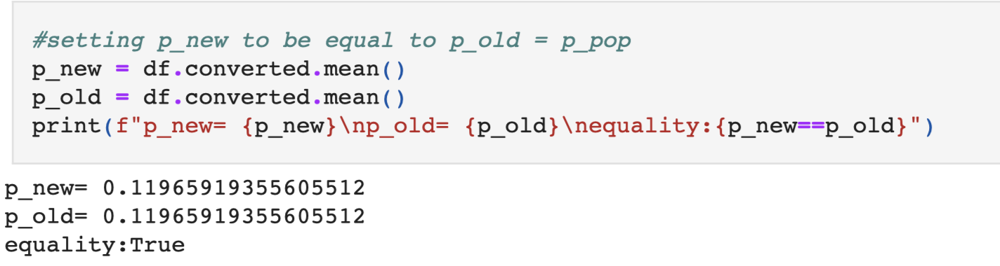
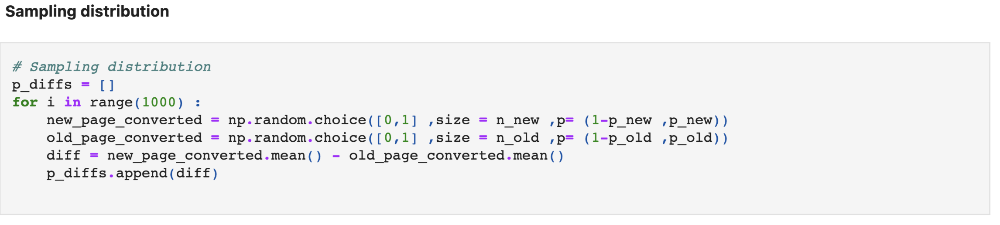
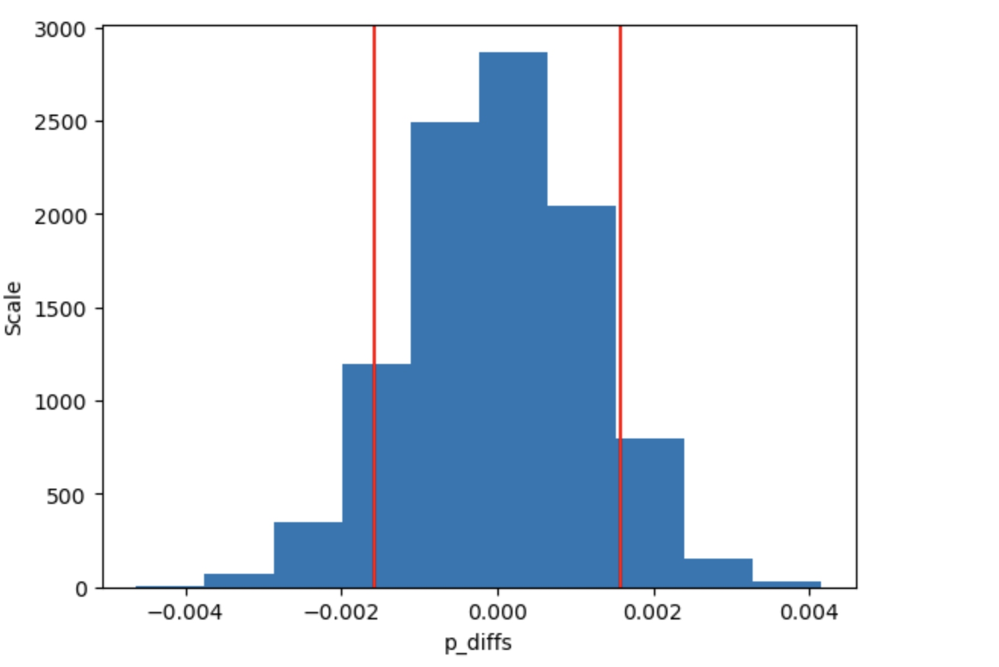

# Analyze a/b test result

## Introduction  
A/B testing, also known as split testing, is a method of comparing two versions of a webpage or app against each other to determine which one performs better. It is a fundamental technique used in marketing, product development, and user experience optimization.

This repository contains the tools and resources necessary to conduct A/B tests effectively. By systematically varying elements of a product or website and analyzing user responses, we can make data-driven decisions to improve performance, engagement, and conversion rates.

In this README, we'll provide an overview of A/B testing, its importance, and how to use this framework to implement and analyze experiments. Whether you're a developer, marketer, or data scientist, understanding and leveraging A/B testing can significantly enhance your ability to optimize products and user experiences.

Let's dive in and explore the world of A/B testing togethe

## Hypothesis 
:max_bytes(150000):strip_icc()/null-hypothesis-vs-alternative-hypothesis-3126413-v31-5b69a6a246e0fb0025549966.png)

### That is the most important part

You start first by assuming for example that the new **page/strategy/method** etc.., will be significantly better than the previous one you have.
 

strating from this point we can walk along our assumption to try proving if it's really working or not.
 

so how we can decide such decision?
 

First you have to get the obseved value you got from the data 

then taking multiple samples supporting your assumption/hypothesis, for example if you assumed that the previous page design will lead to overall greater percentage of conversions, you will start gathering samples supporting this by making these samples gathered from data that has greater percentage of conversions on purpoose

**Then evaluate the results to see whether the observed value could be following the assumed distribution of the assumed data or not**

# p-value
**It's all about probability**, p-value is nothing but the probability of observing whether the observed value is following our assumed distribution or not. 

By setting threshold to see if it's below that threshold, it indicates that mostly the observed value doesn't follow the distribution and vice versa.

# observation 
Regarding our case it was assumed that new page and old page conversion rate are equal.

by walking along with this assumption and looking for the p-value it was observed that we cannot reject the null hypothesis which says that there is no differnce between old and new page in conversion's rate

and that helped us to know that we need to consider redesigning the new page to help us get more conversions.
